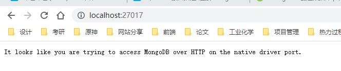

### 连接Mongodb数据库

这里我们不使用老师的方法(mLab已经更新为mongodb Altas,方法依旧但连接不稳定)

所以这边使用的是本地mongodb数据库

安装和使用方法 Windows 平台安装 MongoDB ( https://www.runoob.com/mongodb/mongodb-window-install.html)

数据目录不会主动创建,要先自行新建文件夹后,再使用命令行工具,在mongod.exe目录下,输入`mongod --dbpath=你的数据库路径`

比如`mongod --dbpath=..\data\db`

### 执行完毕数据库就已经启动了,不要关闭命令行工具,请最小化保持运行

然后服务器会默认运行在`127.0.0.1:27017`,在浏览器中如图所示

<>

为了能对数据库进行操作,我们需要安装mongoose

在终端里输入`npm install mongoose`

并在server.js中引入

```javascript
//Mongoose是在node异步环境下对mongodb进行编写对象操作的工具,为模型提供了一种直接的，基于schema结构去定义你的数据模型。它内置数据验证， 查询构建，业务逻辑钩子等，开箱即用。
const mongoose = require("mongoose");
```

可以往下直接写来连接数据库

```javascript
//test为mongodb中的数据库,如果test数据库不存在,则会自动创建,可以自行更改
mongoose.connect('mongodb://127.0.0.1:27017/test')
```

老师的写法是新建一个文件保存地址,然后引用其地址

方法为:新建一个config文件夹(与server.js在同一目录),内建一文件keys.js,并输入

```javascript
//in keys.js
module.exports = {
  mongoURI: "mongodb://127.0.0.1:27017/test",
};
```
在server.js中引入

```javascript
//in server.js
//引入数据库地址
const db = require("./config/keys").mongoURI;
mongoose.connect(db);
```

为了验证服务器是否连接到了数据库,我们接着写

```javascript
//使用 mongoose.connect() 方法连接 MongoDB,成功就输出"连接成功",出现异常时输出错误
mongoose
  .connect(db)
  .then(() => {
    console.log("MongoDB connected!");
  })
  .catch((err) => {
    console.log(err);
  });
```

在终端启动服务器(比如之前的`npm run server`)

终端会出现`MongoDB connected!`提示你成功连接

### 总结

