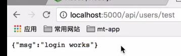
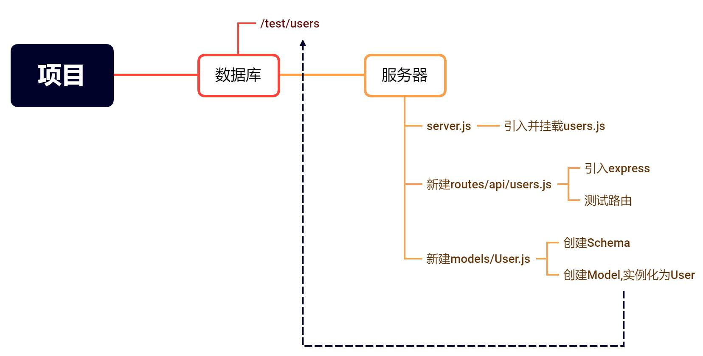

### 搭建路由和数据模型

.

路由

路由是指确定应用程序如何响应客户端对特定端点的请求，该端点是 URI（或路径）和特定的 HTTP 请求方法（GET、POST 等）。

每个路由可以有一个或多个处理函数，当路由匹配时执行。

路由定义采用以下结构：

```javascript
app.METHOD(PATH, HANDLER)
```

摘自 express中文网-基本路由 (<https://www.expressjs.com.cn/en/starter/basic-routing.html>)

.

数据模型

Mongoose 的一切始于 Schema。每个 schema 都会映射到一个 MongoDB collection ，并定义这个collection里的文档的构成。

Models 是从 Schema 编译来的构造函数。 它们的实例就代表着可以从数据库保存和读取的 documents。 从数据库创建和读取 document 的所有操作都是通过 model 进行的。

.

新建一个routes文件夹(与server.js在同一目录)

再新建一个api文件夹(在routes文件夹内)

在api文件夹内新建users.js文件

### users.js储存了有关用户数据操作的路由

现在先引入express和实例化router

```javascript
//in routes/api/users.js
const express = require('express');
const router = express.Router();
```

.

一个router对象是一个单独的实例关于中间件和路由。你可以认为其是一个"mini-application"（迷你程序），其具有操作中间件和路由方法的能力。每个Express程序有一个内建的app路由。

路由自身表现为一个中间件，所以你可以使用它作为app.use()方法的一个参数或者作为另一个路由的use()的参数。

顶层的express对象有一个Router()方法，你可以使用Router()来创建一个新的router对象。

一旦创建了路由器对象，就可以像应用程序一样向它添加中间件和HTTP方法路由(例如get、put、post等)

摘自 @XiangZhou-express 4.x api 中文手册 (<https://www.zybuluo.com/XiangZhou/note/208532>)

.

测试一下路由

```javascript
//in users.js
// @route  GET api/users/test
// @desc   返回的请求的json数据
// @access public
router.get('/test', (req, res) => {
  res.json({ msg: 'login works' });
});
```

路由方法写好了:现在当我们访问`指定路径/test`时,就会返回信息`login works`

要去使用路由,得先引出users.js,再到server.js引入

```javascript
//in users.js 
module.exports = router;
```

```javascript
//in server.js
//引入用户相关路由模块
const users = require("./routes/api/users");
```

.

module.exports
Node应用由模块组成，采用CommonJS模块规范。

根据这个规范，每个文件就是一个模块，有自己的作用域。在这些文件里面定义的变量、函数、类，都是私有的，对外不可见，因此规避掉了作用域污染。

根据CommonJS规定，每个模块内部，module变量代表当前模块，这个变量是一个对象，它的exports属性（即module.exports）是对外的接口。加载某个模块，其实就是加载该模块的exports属性。

摘自 锕琅 module.export和exports两者区别及使用方法 (https://blog.csdn.net/weixin_44339850/article/details/99887127)

.

引入后再使用

```javascript
//在指定的路径上挂载指定的中间件函数:当请求的路径的基础部分与路径匹配时，中间件函数将执行。
app.use("/api/users", users);
```

接下来在浏览器输入`localhost:5000/api/users/test`

就会出现返回的信息 

### 然后我们需要创建数据模型,用在数据库中存储并进行增删改查.

新建一个models文件夹(与server.js在同一目录)

在models文件夹内新建User.js文件(数据模型文件名字还是尽量与路由方法文件区分开,这里用的是老师的写法)

引入mongoose,并实例化Schema(模式；图式；架构)

```javascript
const mongoose = require('mongoose');
const Schema = mongoose.Schema;
```

创建一个Schema,填入属性和类型,类型需要首字母大写

```javascript
const UserSchema = new Schema({
  name: {
    type: String,
    required: true
  },
  email: {
    type: String,
    required: true
  },
  password: {
    type: String,
    required: true
  },
  avatar: {
    type: String
  },
  identity: {
    type: String,
    required: true
  },
  date: {
    type: Date,
    default: Date.now
  }
});
```
require:必要的数据,没有则不会创建数据集合

使用这个Schema(模式)编译的Models(模型)也需要引出,所以

```javascript
module.exports = User = mongoose.model('users', UserSchema);
```
.

Models 是从 Schema 编译来的构造函数。 它们的实例就代表着可以从数据库保存和读取的 documents。 从数据库创建和读取 document 的所有操作都是通过 model 进行的。

第一个参数是跟 model 对应的集合（ collection ）名字的 单数 形式。 Mongoose 会自动找到名称是 model 名字 复数 形式的 collection 。 对于上例，User 这个 model 就对应数据库中 users 这个 collection。.model() 这个函数是对 schema 做了拷贝（生成了 model）。 你要确保在调用 .model() 之前把所有需要的东西都加进 schema 里了！

摘自 Mongoose 5.0 中文文档-Models (http://www.mongoosejs.net/docs/models.html)

.

总结

