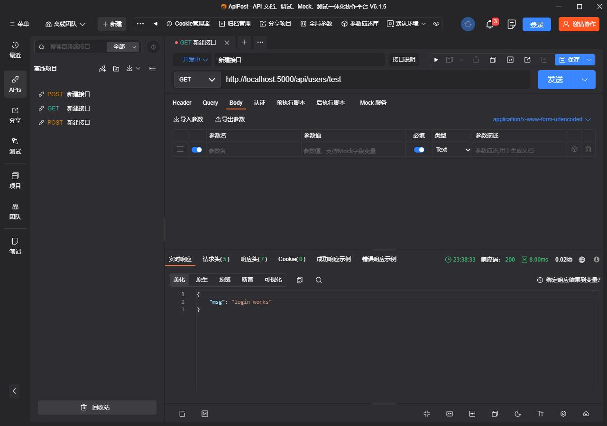
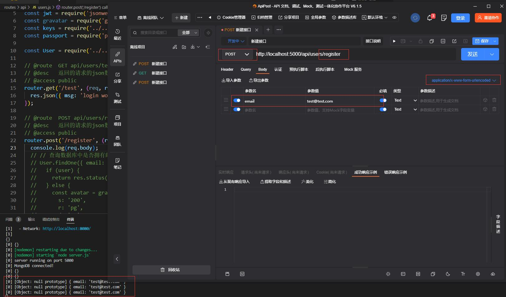
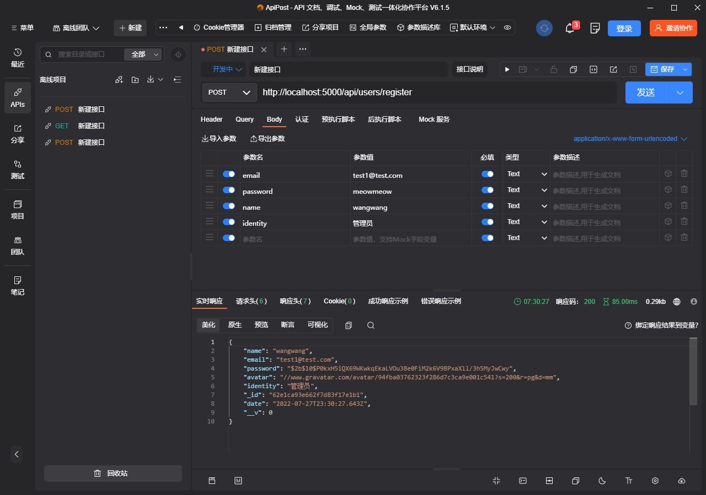
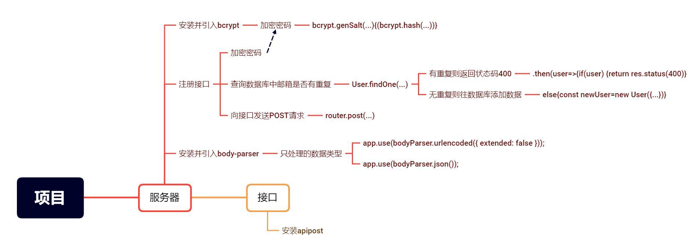

### 搭建注册接口并存储数据

接下来要搭建注册接口,但首先讲的是接口测试工具

老师用的是postman,我根据弹幕建议用的是apipost(postman为英文界面,apipost是中文界面)

下载ApiPost软件,打开如图所示,使用前请运行服务器和数据库



准备好软件,就可以写注册接口了

在写之前需要npm安装body-parser

在终端输入`npm install body-parser`即可安装

.

body-parser介绍

处理用户post请求提交的数据，把数据保存在req.body中。以一个对象的形式提供给服务器，方便进行后续的处理。由于无论用户提交什么服务器都会接受，所以需要在使用数据前进行验证来提高安全性。

注意:此中间件已经被express集成，无需调用安装body-parser，可以直接采用express.json()和express.urlencoded()实现相同功能。东西都是一样的，所以这里还是使用body-parser来介绍。

摘自 神的孩子都在跳舞-深入浅出 Express 中间件 body-parser (<https://zhuanlan.zhihu.com/p/405704013>)

原来已经集成了呀......

.

安装完body-parser之后还需要在server.js中引入

```javascript
//in server.js
//引入body-parser,bodyparser是一类处理request的body的中间件函数,对传入的请求体进行解析
const bodyParser = require("body-parser");
```

引入后,同样需要在server.js中使用此中间件

```javascript
//这是常用的方法，常见的前端请求解决方案如表单post提交、axios、fetch等库的post请求都需要这个中间件进行解析，返回json的格式数据。当请求的数据类型是application/x-www-form-urlencoded时才会进入这个中间件进行处理。
app.use(bodyParser.urlencoded({ extended: false }));
//解析并返回 json格式的数据，这是常用的方法。内部会查看content-type，只有是正确的content-type默认是application/json才进入这个中间件解析处理。
app.use(bodyParser.json());
```

注释摘自 神的孩子都在跳舞-深入浅出 Express 中间件 body-parser (<https://zhuanlan.zhihu.com/p/405704013>)

接下来就是写接口了,首先写一个注册接口

我们会将注册的邮箱和密码发送到服务器,首先是"发送"

在users.js中写下如下代码

```javascript
//in users.js
router.post('/register', (req, res) => {
    console.log(req.body)
    });
```

接下来可以测试一下这个接口



图中:

接口方法要使用POST,

路径与接口路径相同,

数据类型是application/x-www-form-urlencoded,

至少要发送内容否则代码只会返回空对象,

`[Object:null prototype]`为在新版本node.js中,我们使用了旧的URL接口,新接口为`new URL(input[, base])`,目前不影响使用,如何更改这里就不演示了(因为我没改成功),具体可自行搜索.

.

POST 介绍

POST 方法用来传输实体的主体。 虽然用 GET 方法也可以传输实体的主体，但一般不用 GET 方法进行 传输，而是用 POST 方法。虽说 POST 的功能与 GET 很相似，但 POST 的主要目的并不是获取响应的主体内容。

摘自《图解http》（上野宣 著）

.

当我们的数据"发送"之后,服务器需要"判断"提交的邮箱是否和数据库中已经保存的邮箱有重复,我们需要引入数据库中的`User`来进行操作.

```javascript
//in users.js
const User = require('../../models/User'); 
```

接下来我们修改之前的代码为

```javascript
//in users.js
router.post('/register', (req, res) => {
  // 查询数据库中是否拥有邮箱
  User.findOne({ email: req.body.email }).then(user => {
    if (user) {
      return res.status(400).json('邮箱已被注册!');
            }
        })
    })
```

.

上面代码中 `findOne()` 查询被执行时，查询结果被传给回调函数。形式为 `findOne({'xxx':'xxx'},callback(error,result))`

但如果不传callback参数,则Query 的一个实例（一个 query 对象）被返回，这个 query 提供了构建查询器的特殊接口。

Query 实例有一个 `.then()`函数，then() 方法返回一个 Promise .

Promise 对象用于表示一个异步操作的最终完成（或失败）及其结果值.

它最多需要有两个参数：Promise 的成功和失败情况的回调函数,语法为

```javascript
p.then(onFulfilled[, onRejected]);

p.then(value => {
  // fulfillment
}, reason => {
  // rejection
});
```

上面代码中 `.then(user => {...})` 对应 `.then(value => {...}` ,则为 `.then(onFulfilled)`

所以,当 `findOne()` 成功时,将找到的数据集合(包含模型里的所有信息,以对象的形式)传递给 `user` 后, `then()` 携带参数 `user` 执行接下来的函数.

.

如果用户(user)存在,则返回状态码400,并返回json数据"邮箱已被注册!"

如果用户不存在(即可以注册),则为下面的代码

```javascript
router.post('/register', (req, res) => {
  // 查询数据库中是否拥有邮箱
  User.findOne({ email: req.body.email }).then(user => {
    if (user) {
      console.log(user)
      return res.status(400).json('邮箱已被注册!');
    } else {
      const newUser = new User({
        name: req.body.name,
        email: req.body.email,
        password: req.body.password,
        identity: req.body.identity
      });
    }
  })
})
```
创建一个新的User实例,并将POST的名字,email,密码填入,新实例的信息会添加进数据库中.

为了用户信息安全,我们需要对密码进行加密,需要安装npm包bcrypt

在终端输入`npm install bcrypt`

并且引入它

```javascript
const bcrypt = require('bcrypt');
```
bcrypt是一个可以帮助你加密密码的库

不必多说,直接就用吧,将代码添加在`const newUser`函数之后

```javascript
 bcrypt.genSalt(10, function(err, salt) {
        bcrypt.hash(newUser.password, salt, (err, hash) => {
          if (err) throw err;
          newUser.password = hash;
          newUser
            .save()
            .then(user => res.json(user))
            .catch(err => console.log(err));
        });
      });
```
bcrypt官方文档的代码为

```javascript
const bcrypt = require('bcrypt');
const saltRounds = 10;
const myPlaintextPassword = 's0/\/\P4$$w0rD';
const someOtherPlaintextPassword = 'not_bacon';

bcrypt.genSalt(saltRounds, function(err, salt) {
    bcrypt.hash(myPlaintextPassword, salt, function(err, hash) {
        // Store hash in your password DB.
    });
});
```
saltRounds可以适当更改

myPlaintextPassword是你需要加密的密码

hash即为已经加密的密码,在我们的代码中是将加密后生成的字符串覆盖了之前的密码

更多用法在(https://www.npmjs.com/package/bcrypt)

然后执行存储方法`save()`,当您使用 new 创建 Mongoose 模型的实例时，调用 save() 会使 Mongoose 插入一个新文档。

存储成功了,就会返回json数据(在代码中为user对象)

出错则会返回错误

接下来在ApiPost测试一下



数据返回成功!

### 总结

